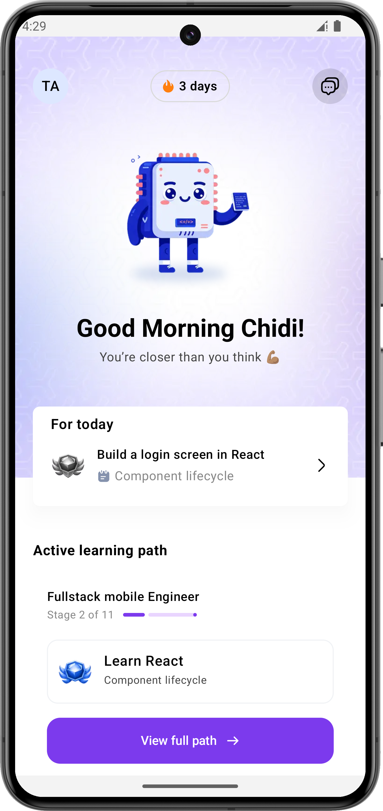
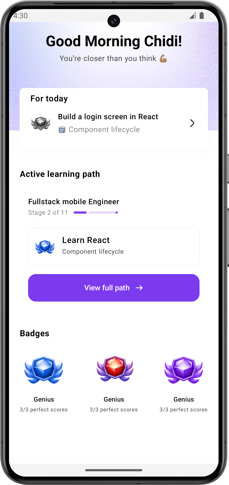
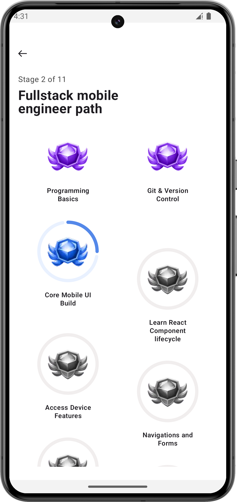
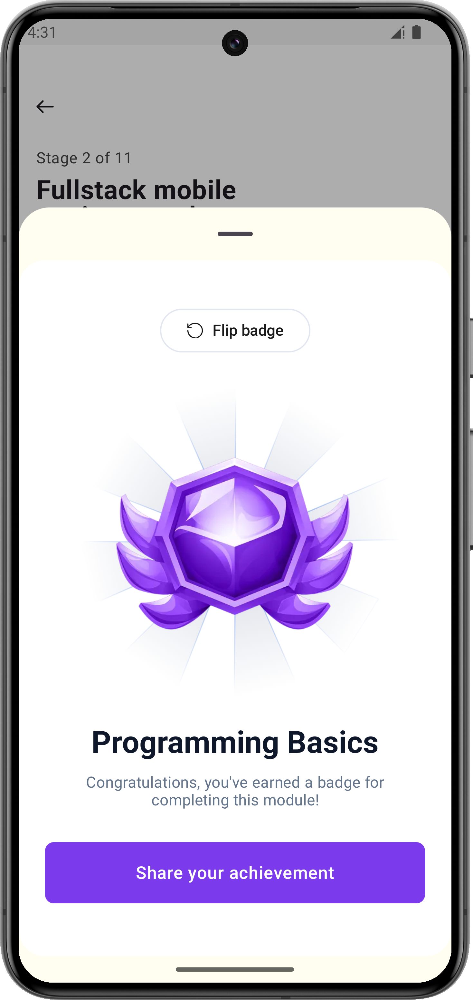

# Grey Assessment - Android Project

A modern Android application template/project built with Jetpack Compose, following Clean Design principles.

     
    
    
    

## 🏗 Architecture

The project is structured following the **MVVM (Model-View-ViewModel)** pattern, 
which promotes a clear separation of concerns:

-   **UI Layer (Compose):** Handles the display of data and user interactions.
-   **ViewModel Layer:** Manages UI state and business logic, surviving configuration changes.

## 📁 Project Structure

The codebase is organized into logical packages to maintain scalability:

-   **`com.baseproject`**: Main application logic.
    -   `ui/`: Composable screens (`screens/`), reusable components (`custom/`), list items (`listItems/`), and modals.
    -   `navigation/`: Navigation graphs and route definitions using Compose Navigation.
    -   `viewModel/`: UI-related state holders.
    -   `repository/`: Data repositories (Single Source of Truth).
    -   `network/`: Retrofit API services and network client configuration.
    -   `data/`: Room entities, DAOs, and database configuration.
    -   `di/`: Dependency injection modules (e.g., Hilt or Koin).
    -   `theme/`: Material 3 design system implementation (Colors, Dimensions, Typography).
    -   `appManager/`: Global application state managers.
    -   `extentions/`: Kotlin extension functions for cleaner code.
-   **`com.utility`**: Generic utility classes and permission handling helpers.

## 🛠 Tech Stack

-   **Language:** Kotlin
-   **UI Framework:** Jetpack Compose (Material 3)
-   **Navigation:** Jetpack Navigation Compose

## 🚀 Getting Started

### Prerequisites
- **Android Studio Ladybug** | 2024.2.1 or newer.
- **JDK 17** (standard for modern Android projects).
- **Android SDK 24** (Minimum supported version).

## 🧪 Testing
-   **Unit Tests:** Located in `app/src/test`. Run with `./gradlew test`.
-   **Instrumented Tests:** Located in `app/src/androidTest`. Run with `./gradlew connectedAndroidTest`.
